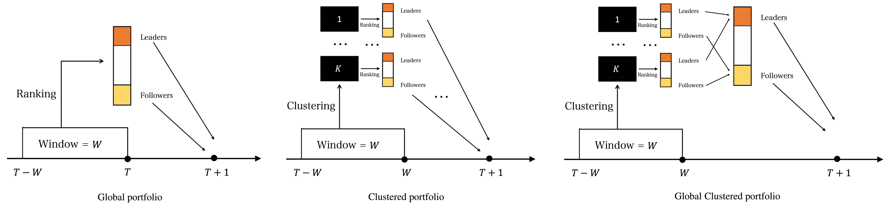
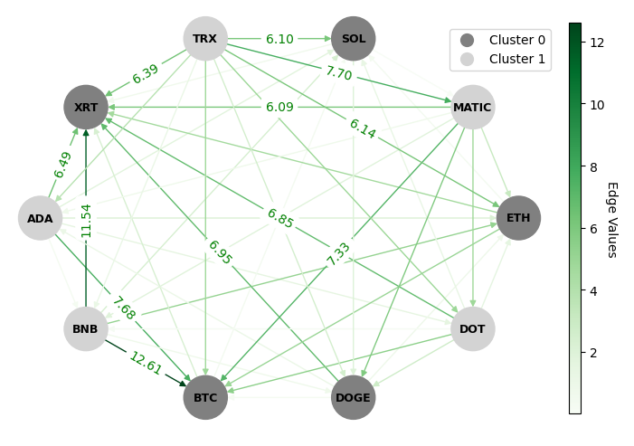
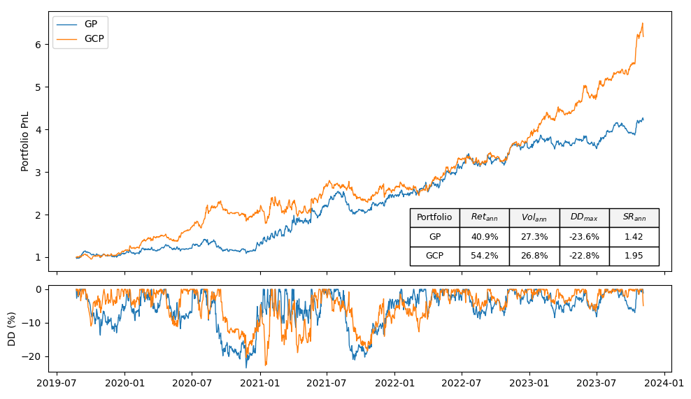
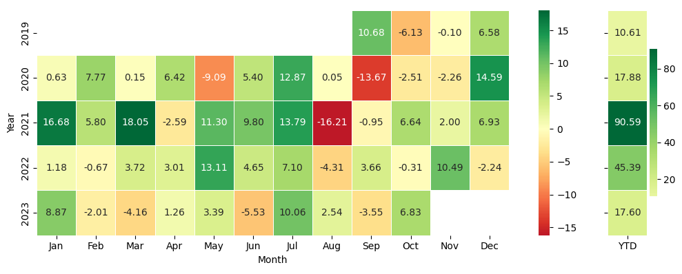
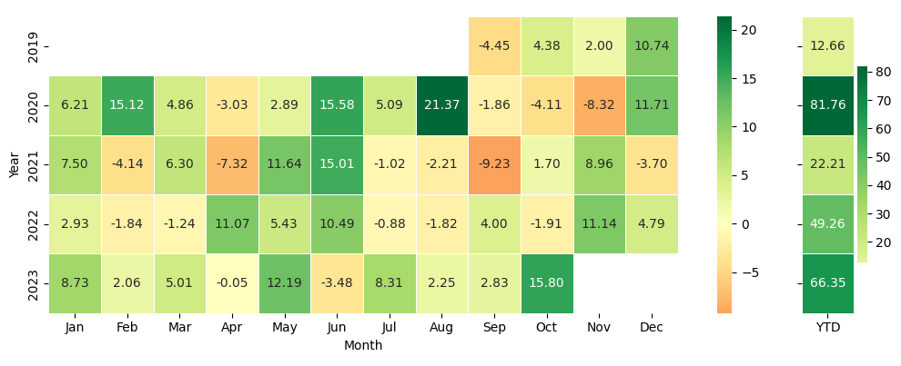

   
   

# **Portfolio Construction Using Lead-Lag Relationships Discovery**

> In this repository, we leverage the **Lévy-area** concept tied to **Signatures** from rough path theory for lead-lag discovery in a universe of cryptocurrencies, to build a *Global Portfolio (GP)*. We also apply **Hermitian clustering**, a cutting-edge algorithm, to cluster the directed lead-lag network, trying to creat two superior portfolios, i.e. *Clustered (CP)* and *Global-Clustered Portfolio (GCP)* with higher returns and Sharpe ratios than the Global Portfolio.

     

## **1. Introduction**

Price changes in some assets often exhibit a tendency to follow those of others, a phenomenon commonly referred to as a **lead-lag relationship**. Our objective is to identify these relationships without explicitly assuming a link between asset characteristics and lead-lag dynamics. Instead, we employ **a data-driven method** that utilizes asset returns to discern leaders and followers. Furthermore, we illustrate that the identified lead-lag relationships carry economic significance, when utilized for constructing a market-neutral portfolio.

## **2. Methodology**

The methodology we used, includes three steps:

1. In the first step, we utilize the **Lévy-area** of pairwise cryptocurrency returns to score the lead-lag relationships between them. This scoring method is capable of capturing both linear and nonlinear lead-lag relationships. The sign of the score indicates which of the two cryptocurrencies is more likely the leader, while the magnitude of the score quantifies the strength of the lead-lag relationship. We compute pairwise scores for all combinations of cryptocurrency pairs and employ these scores to construct a matrix, which we refer to as the **lead-lag matrix**.

2. In the second step, we utilize the lead-lag matrix to **rank assets from the most likely to be a leader to the most likely to be a follower**. This involves computing the mean of each row in the lead-lag matrix and arranging the rows in descending order based on their means. A priori, cryptocurrencies in rows with higher means are more likely to be leaders, while those in rows with lower means are more likely to be followers.

3. Finally, having identified a set of leaders and a set of followers, we use the sign of the previous return of the leader set as a buy/sell signal to construct the **global portfolio** and evaluate the economic significance of the discovered lead-lag relationships. Additionally, in the **clustered portfolio**, assets are grouped into $K$ clusters using the Hermitian algorithm applied to the lead-lag directed network built with the lead-lag matrix. Subsequently, $K$ lead-lag portfolios are constructed. For the **global clustered portfolio**, we aggregate the leaders and followers of each of the $K$ clusters to build another portfolio, following the same process as the global Portfolio.

Figure 1 illustrates the global, clustered, and global-clustered portfolios. The strategy for the global clustered portfolio is proposed in this repository, while the other two are proposed in the reference papers.

  
  
<strong style="font-size: small;">Figure 1. Explanation of the portfolio types.</strong>

## **3. Lévy-area and Hermitian Clustering**

### **3.1. Lévy-area**

The signature of a path, or **path signature**, holds intriguing applications in the field of machine learning. The core concept behind employing the signature transformation for machine learning problems lies in its ability to extract characteristic features from data. Embedding data into a path and computing its signature provides crucial insights into the original data. The workflow is straightforward and can be summarized by the following algorithm:

$$\text{data} \rightarrow \text{path} \rightarrow \text{signature of path} \rightarrow \text{features of data}$$

In this repository, instead of extracting features, we leverage another property of path signatures—their ability to quantize lead-lag relationships between two time series. To achieve this, we transform a pair of time series into a path, compute the path signature, and ultimately derive the Lévy area. This is done following the workflow:

$$\text{time series data} \rightarrow \text{path} \rightarrow \text{signature of path} \rightarrow \text{Lévy area}$$

For path signatures, we consider their **truncated at level 2** version, which has the following components:

$$
S = \{1, S^{(1)}, S^{(2)}, S^{(1,1)}, S^{(1,2)}, S^{(2,1)}, S^{(2,2)}\}
$$

And calculate the Lévy area using the following formula:

$$
Lévy^{area} = \frac{1}{2}\left(S^{(1,2)}-S^{(2,1)}\right)
$$

### **3.2. Hermitian Clustering**

Graph clustering is a basic technique in machine learning, and has widespread applications in different domains. While spectral techniques have been successfully applied for clustering undirected graphs, the performance of spectral clustering algorithms for directed graphs (digraphs) is not in general satisfactory. When the underlying graph to cluster is undirected, the objective is to partition the nodes of the graph into clusters such that nodes within the same cluster are on average better connected to one another than nodes belonging to different clusters. These algorithms usually require symmetrising the matrix representing a digraph, and typical objective functions for undirected graph clustering do not capture cluster-structures in which the information given by the direction of the edges is crucial. To overcome these downsides, **Hermitian clustering** which is a spectral clustering algorithm based on a complex-valued matrix representation of digraphs is implemented in this project to cluster the directed lead-lag networks, generated using Lévy pairwise lead-lag metric. In this clustering algorithm, the cluster-structure is given not only by variations in edge densities, but also by the direction of the edges. By applying Hermitian clustering to the directed netwrok, you can find clusters with high flow imbalance between any pair of clusters, as shown in Figure 3.

  
  
<strong style="font-size: small;">Figure 2. A Hermitian Clustered Lead-Lag Directed Network</strong>

These clusteres are used to build clustered and global clustered portfolios to show the economic significance of the discovered lead-lag relationships. 

## **4. Selected Results**

Global and global-clustered portfolios are assessed based on annualized return, annualized volatility, annualized Sharpe ratio, and maximum drawdown of the portfolio. The return of the portfolio reflects the predictive power of the lead-lag relationship; volatility and Sharpe ratio indicate the risks associated with lead-lag portfolios, and maximum drawdown highlights instances when lead-lag relationships temporarily break down.

As depicted in Figure 3, the global portfolio (GP) and global-clustered portfolio (GCP) performed almost equally in terms of annual volatility and maximum drawdown, with values of approximately 27% and 23%, respectively. However, the GCP outperformed the GP in terms of annual return and Sharpe ratio. The annual return for the GP and GCP portfolios are 40.9% and 54.2%, respectively, resulting in Sharpe ratios of 1.42 and 1.95 for the GP and GCP. These numbers are promising when compared with the broader market proxy we studied—a proxy that experienced nearly an 80% drawdown and a Sharpe ratio of less than 0.5.

  
  
<strong style="font-size: small;">Figure 3. GP and GCP portfolios performance over time.</strong>

Figures 4 and 5 display the monthly and YTD returns for GP and GCP, respectively. We provided these figures, so that the readers could be able to compare the performance of lead-lag portfolios with the [**Cryptocurrency Traders Index**](https://portal.barclayhedge.com/cgi-bin/indices/displayHfIndex.cgi?indexCat=Barclay-CTA-Indices&indexName=Cryptocurrency-Traders-Index), as reported by BarclayHedge. The index aggregates data from cryptocurrency funds reporting their performance. 

  
  
<strong style="font-size: small;">Figure 4. Global portfolio monthly and YTD returns.</strong>

  
  
<strong style="font-size: small;">Figure 5. Global-clustered portfolio monthly and YTD returns.</strong>

It's important to note that the clustered portfolio proposed in the reference papers failed to outperform the global portfolio for the studied universe. You can find the results for the clustered portfolio in the relevant notebook.

## **5. Project Structure**

The structure of this repository is organized as follows:

   <pre>
📦 lead-lag-portfolios
┣ 📂 data
┃ ┗ 📜 ... (data files used in the project)
┣ 📂 images
┃ ┗ 📜 ... (images used in the README or project)
┣ 📂 notebooks
┃ ┣ 📜 01-problem-description-methodology.ipynb
┃ ┣ 📜 02-signature-and-levy-area.ipynb
┃ ┣ 📜 03-directed-networks-hermitian-clustering.ipynb
┃ ┗ 📜 04-backtesting-levy-leadlag-portfolios.ipynb
┣ 📂 src
┃ ┣ 📜 levy.py
┃ ┣ 📜 hermitian.py
┃ ┗ 📜 portfolio.py
┣ 📜 .gitignore
┣ 📜 LICENSE
┣ 📜 README.md
┗ 📜 requirements.txt
   </pre>

## **6. Contributing**

Contributions to this repository are welcome and encouraged. If you have insights, improvements, or additional resources to share, please submit a pull request. For major changes, it's best to open an issue first to discuss your ideas.

## **7. License**

This repository is available under the [MIT License](MIT-LICENSE.txt). Feel free to use and adapt the content for your purposes.

## **8. Reference Papers**

In our quest for lead-lag discovery in financial markets, we leveraged insights and methodologies from various sources that significantly contributed to this project. Below, we provide a list of references that played a key role in shaping our approach:

1. Bennett, S., Cucuringu, M., and Reinert, G. (2022). [Lead-Lag Detection and Network Clustering for Multivariate Time Series with an Application to the US Equity Market](https://arxiv.org/abs/2201.08283).
2. Cartea, Á., Cucuringu, M. and Jin, Q. (2023) [Detecting Lead-Lag Relationships in Stock Returns and Portfolio Strategies](https://papers.ssrn.com/sol3/papers.cfm?abstract_id=4599565).
3. Chevyrev, I., Kormilitzin, A. (2016). [A Primer on the Signature Method in Machine Learning](https://arxiv.org/abs/1603.03788).
4. Reizenstein, J., Graham, B. (2018). [The iisignature Library: Efficient Calculation of Iterated-Integral Signatures and Log Signatures](https://arxiv.org/abs/1802.08252).
5. Cucuringu, M., Li, H., Sun, H., Zanetti, L. (2019) [Hermitian Matrices for Clustering Directed Graphs: Insights and Applications](https://arxiv.org/abs/1908.02096).